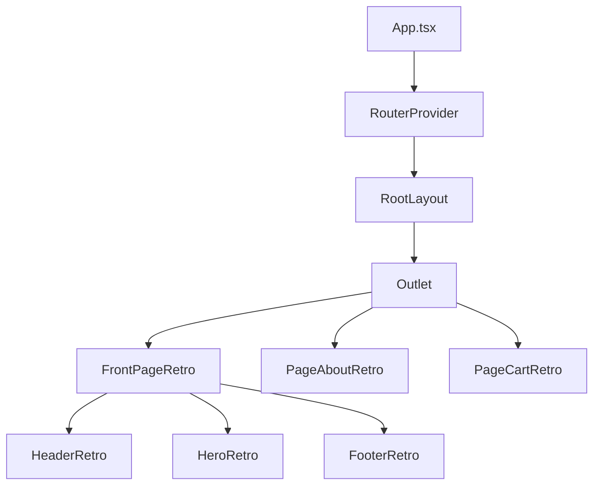

# README Standards

This document defines the authoritative rules for structuring, writing, and maintaining README files across the PlayPocket repository. The root `/README.md` and every subdirectory README must follow these standards.

## Structural Requirements

Every README must contain the following sections in the specified order. Sections marked as "Required" must be present. Sections marked as "Conditional" are required only when the condition is met.

### Section Order

| Order | Section | Required | Purpose |
|---|---|---|---|
| 1 | Project Anchor | Required | Defines the project identity, role, and AI agent directives. |
| 2 | Badges | Conditional (root README only) | Displays build status, version, license, and WCAG compliance. |
| 3 | Quick Start | Required | Provides executable commands to install and run the project. |
| 4 | Repository Map | Required | Lists the directory structure with descriptions for each folder. |
| 5 | Usage | Required | Explains how to use the project's primary features. |
| 6 | Configuration | Conditional | Documents environment variables, config files, and build options. |
| 7 | Architecture | Conditional | Describes the high-level system design with diagrams and text descriptions. |
| 8 | Contributing | Conditional | Explains how external contributors can submit changes. |
| 9 | License | Required | States the project license. |
| 10 | Links | Conditional | Provides links to related documentation, guidelines, and external resources. |

## Project Anchor

The Project Anchor is the first content section of the README. The Project Anchor defines the project's identity, its role in the broader ecosystem, and directives for AI agents that will process the file.

### Required Components

The Project Anchor must contain three elements:

1. **Project title and one-line description.** A single H1 heading followed by one sentence describing what the project does.
2. **Role statement.** A brief paragraph (two to four sentences) explaining the project's role, its target audience, and its primary use case.
3. **AI agent directive.** A blockquote or admonition that instructs AI agents on how to interpret the README and what actions the AI agent should or should not take.

### Example Project Anchor

```markdown
# PlayPocket

A retro handheld gaming-themed WooCommerce prototype built with React 19, TypeScript, and WordPress FSE block architecture.

## Project Anchor

PlayPocket is a high-fidelity React prototype that maps directly to a WordPress Block Theme structure. The project serves as a design reference and functional demo for a shop-first e-commerce experience with WCAG AA 2.2 accessibility compliance. The primary audience is front-end developers building WordPress/WooCommerce themes.

> **AI Agent Directive:** This README describes the PlayPocket project structure and setup process. When generating code for this project, follow the standards defined in `/guidelines/Guidelines.md`. Do not use Tailwind CSS utility classes. Use WordPress BEM class names and CSS custom properties exclusively. All components must support dark mode through CSS variable redefinition, not conditional class names.
```

### AI Agent Directive Rules

The AI agent directive must:

1. State what the README describes.
2. Reference the primary guidelines file by absolute path.
3. List the two or three most critical rules that an AI agent must follow when generating code for the project.
4. Use imperative voice ("Do not use", "Use exclusively", "Follow the standards").

## Quick Start

The Quick Start section provides the minimum set of executable commands required to install dependencies, configure the environment, and run the project locally. A developer (or AI agent) must be able to copy-paste the Quick Start commands and have a running application.

### Required Components

1. **Prerequisites list.** List all required tools with minimum version numbers.
2. **Installation commands.** Shell commands to clone the repository and install dependencies.
3. **Run command.** The single command to start the development server.
4. **Verification step.** A URL or command to verify the application is running correctly.

### Example Quick Start

````markdown
## Quick Start

### Prerequisites

- Node.js >= 20.0.0
- npm >= 10.0.0
- Git >= 2.40

### Installation

```bash
# Clone the repository
git clone https://github.com/org/playpocket.git
cd playpocket

# Install dependencies
npm install
```

### Run the Development Server

```bash
npm run dev
```

### Verify the Application

Open `http://localhost:5173` in a browser. The PlayPocket homepage with the retro gaming theme should load. Navigate to `http://localhost:5173/sitemap` to verify all 120+ routes are registered.
````

### Quick Start Rules

1. **Every command must be copy-pasteable.** Do not include placeholder values (e.g., `<your-api-key>`) in the main Quick Start flow. If API keys are required, document the key setup in the [Configuration](#configuration-section) section and reference the Configuration section from the Quick Start.
2. **Specify the working directory.** If a command must be run from a specific directory, include the `cd` command.
3. **One command per code block line.** Do not chain commands with `&&` unless the commands are logically atomic (e.g., `cd project && npm install`).
4. **Include expected output.** After the run command, describe what the developer should see (URL, terminal output, or browser behavior).

## Repository Map

The Repository Map section provides a directory tree with descriptions for every top-level folder and key files. The Repository Map enables AI agents to locate files without scanning the filesystem.

### Required Components

1. **Directory tree.** A fenced code block showing the folder structure.
2. **Description table.** A table mapping each directory to its purpose, file count (approximate), and the guideline file that governs the directory's contents.

### Example Repository Map

````markdown
## Repository Map

```
/
├── src/                          # Application source code
│   ├── app/                      # All application logic
│   │   ├── components/           # React components (blocks, patterns, parts)
│   │   ├── templates/            # Page-level template components (75 files)
│   │   ├── contexts/             # React context providers (5 files)
│   │   ├── data/                 # Mock data and constants (14 files)
│   │   ├── hooks/                # Custom React hooks (4 files)
│   │   ├── services/             # API service modules (3 files)
│   │   ├── types/                # TypeScript type definitions (1 file)
│   │   └── utils/                # Utility functions (7 files)
│   └── styles/                   # CSS stylesheets (280 files)
├── guidelines/                   # Documentation and standards (172+ files)
├── reports/                      # Audit reports and findings
├── tasks/                        # Task lists and action items
├── prompts/                      # AI prompt templates
├── scripts/                      # Shell and Python automation scripts
├── App.tsx                       # Root application component
├── routes.minimal.ts             # React Router configuration (120+ routes)
├── CHANGELOG.md                  # Version history (Keep a Changelog format)
└── README.md                     # This file
```

| Directory | Purpose | Governed By |
|---|---|---|
| `/src/app/components/` | All React components organized by WordPress type (blocks, patterns, parts) | `/guidelines/overview-components.md` |
| `/src/app/templates/` | Full-page layout components, one per route | `/guidelines/overview-templates.md` |
| `/src/styles/` | WordPress-aligned CSS with BEM naming and CSS custom properties | `/guidelines/Guidelines.md` Section 4 |
| `/guidelines/` | Project standards, component specs, design tokens, mobile guidelines | `/guidelines/Core-Repository-Guidelines.md` |
| `/reports/` | Dated audit reports and fix documentation | `/guidelines/REPORTING_GUIDELINES.md` |
````

### Repository Map Rules

1. **Update on structural changes.** When a new top-level directory is added or an existing directory is renamed, update the Repository Map immediately.
2. **Approximate file counts.** Include approximate file counts for directories with more than five files. Use the format `(N files)`.
3. **Link to governing guidelines.** For each directory, reference the guideline file that defines the standards for files in the directory.
4. **Depth limit.** Show directory structure to a maximum depth of three levels. Use comments to describe deeper contents.

## Visual Description Standards

All diagrams, screenshots, flowcharts, and visual elements in README files must include detailed text descriptions. AI models cannot interpret images. Text descriptions ensure AI agents can reason about the visual content.

### Rule 1: Alt Text for Images

Every image must include descriptive alt text that conveys the same information as the image. Alt text must describe the content and purpose of the image, not the file name.

```markdown
<!-- CORRECT -->


<!-- INCORRECT -->


```

### Rule 2: Text Description Block for Diagrams

Every diagram (architecture, flowchart, sequence, or entity-relationship) must be accompanied by a text description block immediately below the image. The text description block uses a numbered list or nested bullet list to describe every element and relationship shown in the diagram.

```markdown


**Diagram description:**

1. **App.tsx** renders the `RouterProvider` with the router configuration from `/routes.minimal.ts`.
2. **RootLayout** is the root route element. RootLayout renders:
   - `ScrollToTop` component for scroll restoration.
   - `ErrorBoundary` wrapping a `Suspense` boundary.
   - `Outlet` inside the Suspense boundary, which renders the matched child route component.
   - `QuickView` and `ComparisonBar` as lazy-loaded overlay components.
3. **Template components** (e.g., `FrontPageRetro`, `PageAboutRetro`) are rendered inside the `Outlet` based on the current URL path.
4. **Template components** compose `HeaderRetro` (part), pattern components (e.g., `HeroRetro`), and `FooterRetro` (part).
```

### Rule 3: Mermaid Diagrams Over Images

Prefer Mermaid diagram syntax over static images when the hosting platform supports Mermaid rendering (GitHub, GitLab). Mermaid diagrams are text-based and can be parsed directly by AI agents.

````markdown


**Diagram description:**

1. `App.tsx` renders `RouterProvider` which initializes the router.
2. `RouterProvider` renders `RootLayout` as the root route element.
3. `RootLayout` renders an `Outlet` that displays the matched template.
4. Each template (e.g., `FrontPageRetro`) composes `HeaderRetro`, content patterns, and `FooterRetro`.
````

### Rule 4: Screenshots Must Include Feature Annotations

If a README includes a screenshot of the application UI, the screenshot must be accompanied by a numbered annotation list that identifies every significant UI element visible in the screenshot.

```markdown


**Screenshot annotations:**

1. **Header bar** (top): Contains the PlayPocket logo, five navigation links (SHOP, DEALS, COMMUNITY, ABOUT, ALL PAGES), cart icon, and theme toggle button.
2. **Hero section**: Full-width banner with pixel art decorations, animated title "PLAY POCKET," and two CTA buttons ("SHOP NOW" and "VIEW DEALS").
3. **Category row**: Horizontal scrollable row of five category cards (Apparel, Accessories, Games, Posters, Collectibles), each with a retro pixel border and hover glow effect.
4. **Featured products grid**: Four product cards in a 2x2 grid layout, each showing product image, name, price, and "ADD TO CART" button with neon green accent.
5. **Footer**: Three-column layout with Contact info, FAQ link, About link, and a sitemap link. Copyright notice at bottom.
```

## Contextual Independence

Every H2 section of a README must be written so a reader (human or AI agent) can understand the section without reading any other section of the README. Contextual independence means each section is a self-contained unit of information.

### Rules for Contextual Independence

1. **Define terms on first use.** If a section uses a term defined elsewhere in the README, repeat a brief inline definition. Do not write "as defined above" or "see the previous section" without an explicit anchor link.

2. **Include prerequisite context.** If a section requires the reader to have completed a previous step, state the prerequisite explicitly at the start of the section.

    ```markdown
    ## Usage

    After completing the [Quick Start](#quick-start) installation, the development
    server is running at `http://localhost:5173`.
    ```

3. **Repeat critical constraints.** If a constraint (e.g., "do not use Tailwind CSS") applies to a section, state the constraint in the section even if the constraint was stated in an earlier section.

4. **Self-contained code examples.** Code examples must include all necessary imports and context. Do not write "assuming the imports from the previous example."

    ```markdown
    <!-- CORRECT - self-contained example -->
    ```tsx
    // File: /src/app/components/templates/PageContactRetro.tsx
    import React from 'react';
    import { HeaderRetro } from '../parts/HeaderRetro';
    import { FooterRetro } from '../parts/FooterRetro';

    export const PageContactRetro = () => {
      return (
        <>
          <HeaderRetro />
          <main className="retro-main">Contact Page</main>
          <FooterRetro />
        </>
      );
    };
    ```

    <!-- INCORRECT - depends on previous example -->
    ```tsx
    // Using the same imports as above...
    export const PageContactRetro = () => {
      return <main>Contact Page</main>;
    };
    ```
    ```

5. **Link to related sections.** When a section references information in another section, use an explicit Markdown anchor link. Do not use positional references like "below" or "above" without a link.

    ```markdown
    <!-- CORRECT -->
    See the [Repository Map](#repository-map) section for the full directory structure.

    <!-- INCORRECT -->
    See the section above for the directory structure.
    ```

## Subdirectory README Files

Subdirectory README files (e.g., `/guidelines/README.md`, `/src/app/components/README.md`) follow the same standards as the root README with the following modifications.

### Differences from Root README

| Aspect | Root README | Subdirectory README |
|---|---|---|
| Project Anchor | Full project description with AI directive | Brief scope statement limited to the subdirectory's purpose |
| Quick Start | Full installation and run commands | Not required. Link to root README's Quick Start section. |
| Repository Map | Full repository tree | Directory tree limited to the subdirectory's contents |
| Badges | Required | Not required |
| License | Required | Not required. Link to root README's License section. |

### Subdirectory Project Anchor Example

```markdown
# Guidelines Directory

This directory contains all project standards, component specifications, design tokens, and process documentation for the PlayPocket project.

> **AI Agent Directive:** When generating or modifying documentation in this directory, follow the standards defined in `/guidelines/Core-Repository-Guidelines.md`. Every guideline file must include YAML front matter and follow the Markdown hierarchy rules.

For full project setup instructions, see the [root README](/README.md#quick-start).
```

## Maintenance Rules

README files must be maintained as living documents. Outdated README content is worse than no README because the outdated content misleads developers and AI agents.

### Rule 1: Update on Structural Changes

When any of the following changes occur, the README must be updated in the same commit or pull request:

- A new top-level directory is added or removed.
- A new required tool or dependency is added to the project.
- The Quick Start commands change (e.g., a new environment variable is required).
- The project's primary purpose or architecture changes significantly.

### Rule 2: Review Quarterly

The root README must be reviewed at least once per quarter. During the review, verify:

- All Quick Start commands execute successfully.
- The Repository Map matches the actual directory structure.
- All links resolve to existing files and URLs.
- The AI agent directive reflects the current project constraints.

### Rule 3: Date the Last Update

Include a "Last Updated" line at the bottom of the README with the ISO 8601 date of the most recent update.

```markdown
---

**Last Updated:** 2026-03-15
```

## Validation Checklist

Before committing changes to any README file, verify:

- [ ] Project Anchor section exists with project title, role statement, and AI agent directive.
- [ ] Quick Start section contains prerequisites, installation commands, run command, and verification step.
- [ ] Repository Map section contains a directory tree and description table.
- [ ] Every image has descriptive alt text (not just a filename).
- [ ] Every diagram has a text description block immediately below the diagram.
- [ ] Every H2 section is contextually independent (terms defined, prerequisites stated, examples self-contained).
- [ ] Mermaid syntax is used for diagrams where the platform supports Mermaid rendering.
- [ ] No positional references ("above", "below") without explicit anchor links.
- [ ] All internal links resolve to existing files or anchors.
- [ ] "Last Updated" date at the bottom of the file reflects the current date.
- [ ] File follows the Markdown hierarchy rules from `/guidelines/Core-Repository-Guidelines.md` (single H1, sequential headings, max H4 depth).
